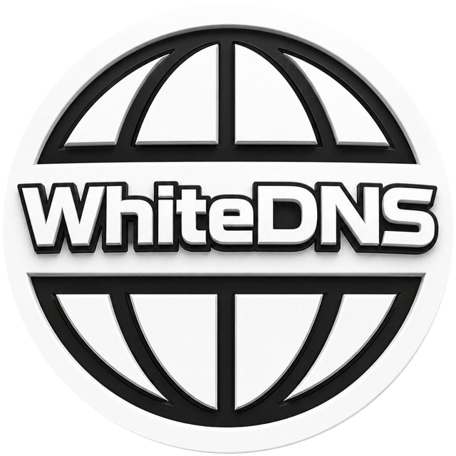
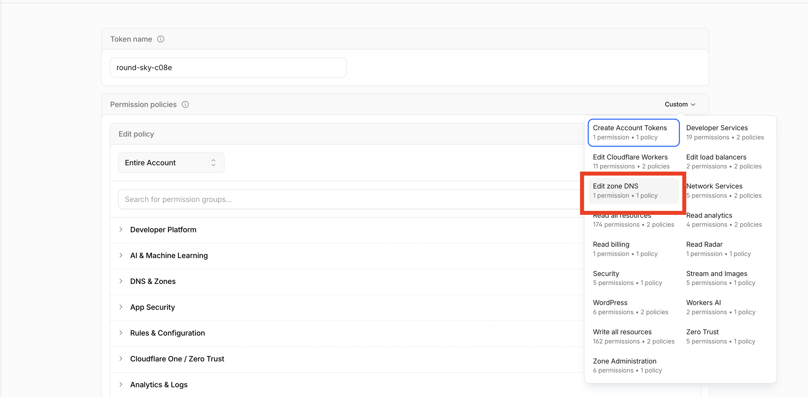
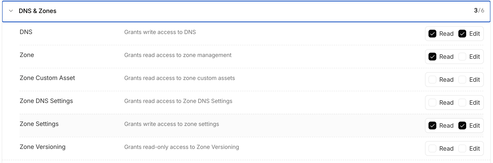
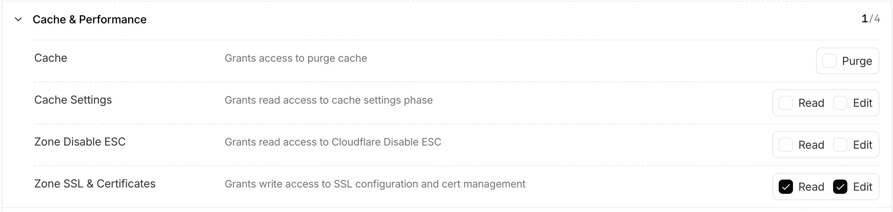

<p align="center">
  
</p>

# WhiteDNS 3X-UI Wizard
[Telegram: @whitedns](https://t.me/@whitedns)

WhiteDNS is a Cloudflare-first provisioning wizard for setting up a managed 3x-ui/Xray VPN stack on a VPS. It runs locally, connects to the VPS over SSH, manages Cloudflare DNS and certificates, installs or repairs a Docker-based 3x-ui stack, and generates copyable client import strings.

The wizard focuses on a practical default setup:

- Cloudflare-proxied WebSocket TLS profiles.
- DNS-only direct profiles for protocols Cloudflare proxy cannot handle.
- Server-side Tor exit variants users can import separately.
- A managed 3x-ui Docker stack with PostgreSQL.
- Encrypted local project secrets and repeatable reset/repair flows.

## Quick Start

### 1. Build the binary

```bash
go build -o whitedns ./cmd/whitedns
```

### 2. Run the interactive wizard

```bash
./whitedns
```

The root command opens the menu. Select:

```text
0) Init setup
```

The wizard will ask for:

- Cloudflare account ID.
- Cloudflare API token.
- Domain name.
- VPS IPv4 address.
- SSH host, user, key/passphrase, or password.

### 3. Cloudflare token permissions

Create an Account API token in Cloudflare:

1. Go to `Manage Account > Account API Tokens > Create Token`.
2. Choose the `Edit zone DNS` template.



3. Scope it to the target domain when possible. Use all domains only when needed.
4. Keep `DNS: Read + Edit`.
5. In `DNS & Zones`, add `Zone: Read` and `Zone Settings: Edit`.



6. In `Cache & Performance`, add `Zone SSL & Certificates: Edit`.



The final required permissions are:

```text
DNS & Zones / DNS: Read + Edit
DNS & Zones / Zone: Read
DNS & Zones / Zone Settings: Edit
Cache & Performance / Zone SSL & Certificates: Edit
```

Cloudflare API docs may call `Edit` permissions `Write`. WhiteDNS uses the account ID you enter for:

```text
GET /client/v4/accounts/<account-id>/tokens/verify
```

Troubleshooting:

| Error area | Usually means |
| --- | --- |
| Token validation | Wrong token, wrong account ID, expired/disabled token, or incompatible token type. |
| Zone lookup | Missing `Zone: Read` or token is not scoped to the selected domain. |
| DNS or ACME DNS-01 | Missing `DNS: Edit`. |
| SSL mode strict | Missing `Zone Settings: Edit`. |
| Origin CA certificate | Missing `Zone SSL & Certificates: Edit`. |

### 4. What the init flow does

The setup flow:

- Validates the Cloudflare token.
- Detects the Cloudflare zone.
- Creates or updates DNS records.
- Sets Cloudflare SSL mode to `strict`.
- Creates a Cloudflare Origin CA certificate for proxied profiles.
- Issues a public ACME wildcard certificate for DNS-only TLS profiles.
- Installs or repairs managed Docker 3x-ui and PostgreSQL.
- Adds a private Tor sidecar for Tor-profile outbound routing.
- Replaces only WhiteDNS-managed inbounds/outbounds after confirmation.
- Prints and saves client import strings.

## DNS Records

WhiteDNS creates these A records for the selected domain. Replace `<domain>` and `<vps-ip>` with your real values.

| Host | Type | Value | Proxy | Purpose |
| --- | --- | --- | --- | --- |
| `vpn.<domain>` | A | `<vps-ip>` | Proxied | VLESS WS TLS through Cloudflare |
| `trojan.<domain>` | A | `<vps-ip>` | Proxied | VLESS WS TLS on 8443 through Cloudflare |
| `panel.<domain>` | A | `<vps-ip>` | DNS-only | 3x-ui dashboard |
| `direct.<domain>` | A | `<vps-ip>` | DNS-only | Direct VLESS TCP TLS |
| `hy2.<domain>` | A | `<vps-ip>` | DNS-only | Hysteria2 UDP |
| `reality.<domain>` | A | `<vps-ip>` | DNS-only | Reality XHTTP |
| `ss.<domain>` | A | `<vps-ip>` | DNS-only | Shadowsocks 2022 |
| `tor-vless-ws.<domain>` | A | `<vps-ip>` | DNS-only | VLESS WS routed through Tor |
| `tor-vless-ws-8443.<domain>` | A | `<vps-ip>` | DNS-only | VLESS WS 8443 routed through Tor |
| `tor-hy2.<domain>` | A | `<vps-ip>` | DNS-only | Hysteria2 routed through Tor |
| `tor-direct.<domain>` | A | `<vps-ip>` | DNS-only | Direct VLESS routed through Tor |
| `tor-reality.<domain>` | A | `<vps-ip>` | DNS-only | Reality XHTTP routed through Tor |
| `tor-ss.<domain>` | A | `<vps-ip>` | DNS-only | Shadowsocks routed through Tor |

ACME also creates temporary TXT records during public certificate issuance:

```text
_acme-challenge.<domain>
```

The app requests a wildcard certificate for `*.<domain>`, so one challenge covers the DNS-only TLS hostnames.

## Generated Client Profiles

WhiteDNS creates import strings for:

| Remark | Host | Port | Transport | Route |
| --- | --- | --- | --- | --- |
| `VLESS WS @whiteDNS` | `vpn.<domain>` | `443/tcp` | WebSocket TLS | Cloudflare proxied |
| `VLESS WS 8443 @whiteDNS` | `trojan.<domain>` | `8443/tcp` | WebSocket TLS | Cloudflare proxied |
| `Hysteria2 @whiteDNS` | `hy2.<domain>` | `443/udp` | Hysteria2 TLS | Direct |
| `Direct VLESS @whiteDNS` | `direct.<domain>` | `2087/tcp` | TCP TLS | Direct |
| `Reality XHTTP @whiteDNS` | `reality.<domain>` | `2083/tcp` | XHTTP Reality | Direct |
| `Shadowsocks @whiteDNS` | `ss.<domain>` | `8388/tcp,udp` | Shadowsocks 2022 | Direct |
| `VLESS WS Tor @whiteDNS` | `tor-vless-ws.<domain>` | `2097/tcp` | WebSocket TLS | Server-side Tor exit |
| `VLESS WS 8443 Tor @whiteDNS` | `tor-vless-ws-8443.<domain>` | `2098/tcp` | WebSocket TLS | Server-side Tor exit |
| `Hysteria2 Tor @whiteDNS` | `tor-hy2.<domain>` | `2099/udp` | Hysteria2 TLS | Server-side Tor exit |
| `Direct VLESS Tor @whiteDNS` | `tor-direct.<domain>` | `2100/tcp` | TCP TLS | Server-side Tor exit |
| `Reality XHTTP Tor @whiteDNS` | `tor-reality.<domain>` | `2101/tcp` | XHTTP Reality | Server-side Tor exit |
| `Shadowsocks Tor @whiteDNS` | `tor-ss.<domain>` | `8390/tcp,udp` | Shadowsocks 2022 | Server-side Tor exit |

Reality profiles currently use either `apple.com` or `docker.com` as the saved SNI and Reality target. Normal TLS profiles keep their own hostnames as SNI so public certificate validation continues to work.

Tor profiles mean:

```text
client -> VPS -> Tor -> destination
```

The VPS still sees the client IP. Destination sites see the Tor exit IP. The Tor SOCKS service is internal to Docker and is not published as a public proxy.

Tor is TCP-oriented. UDP destination traffic from Tor Hysteria2 or Tor Shadowsocks profiles may fail rather than route through Tor.

## Menu Items

Run:

```bash
./whitedns
```

The interactive menu provides:

| Shortcut | Menu item | What it does |
| --- | --- | --- |
| `0` | Init setup | Runs the full setup flow: Cloudflare DNS/SSL/Origin CA, local plans, SSH, Docker 3x-ui, certificates, inbounds, outbounds, clients, and import strings. |
| `1` | Current setup info | Shows saved project details, VPS IP, zone status, DNS/protocol plan summary, remote host, container name, last apply time, and client-links path. |
| `2` | Diagnostics | Checks local files, certificates, DNS, Docker port publishing, Tor sidecar status, panel/API access, Xray config, and common protocol issues. |
| `3` | Repair installation | Re-ensures the managed Docker stack, uploads certificates, repairs/restarts 3x-ui, reapplies WhiteDNS-managed inbounds/outbounds, and regenerates links. |
| `4` | Backup installation | Creates a local backup of the project files and a remote archive of the managed `/opt/wdns-wizard/3x-ui` installation. |
| `5` | Restore latest backup | Restores the latest available WhiteDNS backup for the selected project and managed remote installation. |
| `6` | Support bundle | Writes a troubleshooting bundle with diagnostics, plans, state, logs, Docker status, 3x-ui logs, Tor logs, and relevant remote config snapshots. |
| `7` | Get list of inbounds | Logs into the saved 3x-ui panel over SSH tunnel and lists inbound ID, state, remark, protocol, port, transport/security, and client count. |
| `8` | Get list of outbounds | Reads the Xray outbound config from 3x-ui and lists outbound tags/protocols, including WhiteDNS direct, blocked, and Tor outbounds. |
| `9` | Get list of clients (10 only) | Shows the first 10 clients across inbounds with inbound remark, email, enabled state, masked identifier, expiry, and traffic limit. |
| `d` | Dashboard credentials and login info | Shows the public panel URL, username, password, base path, and private SSH tunnel fallback command. |
| `c` | Change Cloudflare domain | Prompts for a new domain/VPS IP, provisions Cloudflare for the new domain, reuses saved secrets where possible, and reapplies 3x-ui. |
| `r` | Reset installation | Replaces WhiteDNS-managed inbounds/outbounds and reapplies the managed stack while preserving local secrets and client identities. |
| `x` | Delete installation | Removes only WhiteDNS-managed remote inbounds/outbounds and managed stack files when detected. Local project files are kept. |

Navigation:

- `esc` or `b` returns from submenus to the main menu.
- `q` exits.
- Destructive actions require typed confirmation.

## CLI Commands

The interactive menu is the preferred workflow, but the CLI also exposes subcommands:

```bash
./whitedns cloudflare check --domain example.com
./whitedns cloudflare apply --domain example.com --ip 1.2.3.4
./whitedns plan show example.com
./whitedns xui check --domain example.com --ssh-host 1.2.3.4
./whitedns xui plan --domain example.com --ssh-host 1.2.3.4
./whitedns xui apply --domain example.com --ssh-host 1.2.3.4 --yes
```

Useful XUI flags:

```text
--ssh-user root
--ssh-port 22
--ssh-key ~/.ssh/id_ed25519
--ssh-key-passphrase <passphrase>
--ssh-password <password>
--panel-username <username>
--panel-password <password>
--panel-base-path /tp-example/
--acme-email admin@example.com
```

## Output Files

Local project files are written under:

```text
~/.wdns-wizard/projects/<domain>/
```

Important files:

```text
config.yaml
secrets.enc.yaml
cloudflare-state.json
xui-state.json
client-links.yaml
origin/origin.pem
origin/origin.key
certs/public.pem
certs/public.key
plans/dns-plan.yaml
plans/protocol-plan.yaml
plans/xui-plan.yaml
logs/provision-*.log
logs/xui-provision-*.log
```

Remote managed files are kept under:

```text
/opt/wdns-wizard/3x-ui/
```

## Privacy Policy

WhiteDNS is a local CLI/TUI tool. It does not include telemetry, analytics, tracking pixels, remote reporting, or a WhiteDNS-hosted backend.

### What WhiteDNS stores locally

WhiteDNS stores project data on the machine where you run the tool:

```text
~/.wdns-wizard/projects/<domain>/
```

This can include:

- Domain, VPS IP, DNS/protocol plans, state files, logs, and generated client import strings.
- Cloudflare Origin CA certificate material.
- Public ACME certificate material.
- Encrypted secrets in `secrets.enc.yaml`.

Secrets are encrypted locally using a key stored under the WhiteDNS root or provided through:

```text
WDNS_WIZARD_SECRETS_KEY
```

The 3x-ui panel password, Cloudflare token, generated client IDs/passwords, and protocol secrets are not intentionally written in plaintext logs. The Origin CA private key and public ACME private key are written as key files because the server needs them for TLS.

### What WhiteDNS sends to third parties

WhiteDNS communicates only with services needed for provisioning:

- Cloudflare API: token validation, zone lookup, DNS records, SSL mode, Origin CA, and ACME DNS-01 TXT records.
- Let's Encrypt ACME: public certificate issuance for `*.<domain>`.
- Your VPS over SSH: Docker installation, 3x-ui setup, certificates, inbounds, outbounds, diagnostics, backups, and support bundles.
- Docker/GitHub package endpoints when installing Docker Compose plugin fallback binaries.

WhiteDNS does not sell, share, or upload your project data to a WhiteDNS service.

### User responsibility

You control the Cloudflare account, VPS, generated clients, and local project files. Anyone with access to your local machine, project directory, VPS, 3x-ui dashboard, or client import strings may be able to access sensitive configuration.

Keep these private:

- Cloudflare API token and account ID.
- `~/.wdns-wizard` project directory.
- `WDNS_WIZARD_SECRETS_KEY` or `.secrets.key`.
- 3x-ui dashboard credentials.
- Client import strings and private keys.

## Build And Develop

### Requirements

- Go `1.24.2` or newer compatible toolchain.
- SSH access to the VPS for live provisioning.
- Docker-capable Linux VPS for the managed 3x-ui stack. If Docker exists but the Compose plugin is missing, WhiteDNS tries distro packages first, then falls back to the official Docker Compose v2 CLI plugin binary.
- Cloudflare zone and API token.

### Run tests

```bash
go test ./...
```

When using a local project cache:

```bash
env GOCACHE="$PWD/.cache/go-build" go test ./...
```

### Build

```bash
go build -o whitedns ./cmd/whitedns
```

### Release builds

GitHub Release builds are handled by:

```text
.github/workflows/release.yml
scripts/build-release.sh
scripts/release-targets.txt
```

When a GitHub release is published, the workflow runs tests, builds archives for every target in `scripts/release-targets.txt`, writes SHA-256 checksums, stores the files as a workflow artifact, and uploads the same files to the GitHub release.

Run the release builder locally with:

```bash
VERSION=v0.1.0 ./scripts/build-release.sh
```

Artifacts are written to:

```text
dist/
```

The default targets include Linux, macOS, Windows, FreeBSD, OpenBSD, NetBSD, and Termux-compatible Android ARM64. The Termux build uses Go's `android` target and is named like:

```text
whitedns_<version>_termux-android-arm64.tar.gz
```

### Format

```bash
find cmd internal pkg -name '*.go' -print0 | xargs -0 gofmt -w
```

### Development notes

- Keep local state paths stable: `~/.wdns-wizard/...`.
- Keep remote state paths stable: `/opt/wdns-wizard/3x-ui/...`.
- Use the interactive menu for end-to-end testing.
- Use `xui plan` before `xui apply` when testing conflict detection.
- `reset` preserves local secrets and client identities.
- `delete` removes only WhiteDNS-managed remote resources; local project files are kept.
